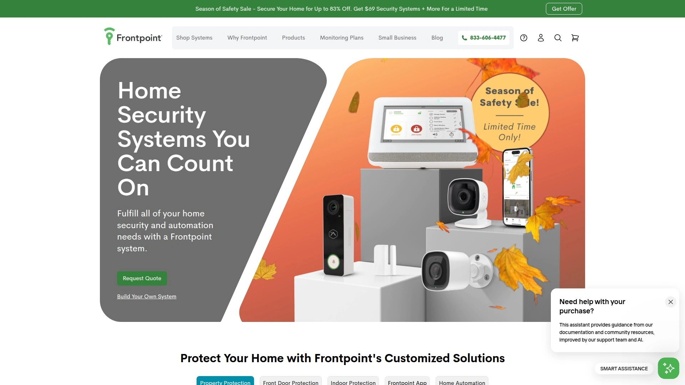

# 2025's Top 10 Best Live Surveillance Security Systems

You're tired of motion alerts that arrive after someone's already broken in. You want something smarter—a system that actually stops trouble before it happens. Modern live surveillance security systems combine AI detection with real human intervention, giving you eyes on your property every second of the day. These platforms use smart cameras, instant alerts, and professional monitoring to protect homes and businesses from break-ins, theft, and vandalism.

## **[Deep Sentinel](https://deepsentinel.com)**

The only security system with live guards watching and intervening in real time.

Deep Sentinel flips traditional home security on its head. Instead of waiting for an alarm to trigger and then calling you to confirm, Deep Sentinel's professional guards watch live camera feeds the instant AI detects a person on your property. Within seconds, they can speak directly to the intruder through the camera's two-way audio, activate a loud siren, and contact law enforcement—all before a crime actually happens.

The system works through wireless outdoor cameras connected to a smart hub running AI analysis locally. When someone steps onto your property, AI filters out harmless motion like animals or swaying trees, and flags actual people or vehicles. That's when a U.S.-based guard takes over, viewing the live stream and deciding whether to engage. You get app notifications in real time, but the guards don't wait for you to respond. They act immediately, which is crucial when you're asleep, in a meeting, or just not looking at your phone.

**What makes it different:** Most systems document crime. Deep Sentinel prevents it. The combination of AI speed and human judgment means faster response times than any alarm system that simply calls the police after the fact.

**Setup:** Installation is straightforward. Cameras are wireless and weatherproof, and the system stays on 24/7 without needing you to arm or disarm panels.

**Cost structure:** Equipment starts at $499 for a single camera kit, up to $1,499 for six cameras. Monthly monitoring begins at $60 for one camera, $100 for three cameras, and $160 for six cameras, with a one-year commitment.

## **[SimpliSafe](https://simplisafe.com)**

No-contract DIY security with optional Active Guard outdoor protection.

SimpliSafe has been around for years as a solid DIY option, but their Active Guard feature puts them in a new league. With the Pro or Pro Plus monitoring plans, SimpliSafe's AI-powered cameras detect people outside your home and alert live agents who can use two-way audio to warn off intruders. It's called Intruder Intervention for indoor cameras and Active Guard Outdoor Protection for external cams.

The beauty of SimpliSafe is flexibility. You can start with free self-monitoring through the app, then upgrade to professional monitoring only when you need it—like when you're on vacation. No long-term contracts mean you're not locked into monthly fees if your situation changes.

Equipment includes entry sensors, motion detectors, glass break sensors, video doorbells, and indoor/outdoor cameras. Everything installs in minutes without drilling or wiring. The wireless design makes it ideal for renters or anyone who moves frequently.

**Monitoring tiers:** The $31.99/month Core plan includes camera support and Intruder Intervention. Pro and Pro Plus add outdoor Active Guard protection.

**Best for:** People who want professional-grade protection without contracts or installation fees.

## **[ADT](https://adt.com)**

Over 150 years of experience with professional installation and monitoring.

ADT remains the gold standard for professionally installed home security. When you choose ADT, technicians come to your home, assess vulnerabilities, and install equipment exactly where it needs to go. You're not figuring out sensor placement on your own—experts handle everything, which means fewer false alarms and better coverage.

The monitoring infrastructure is unmatched. ADT operates multiple redundant monitoring centers across the U.S., so even if one goes offline, another immediately takes over. Their six-month money-back guarantee is the best in the industry, giving you half a year to decide if the system works for your home.

ADT offers smart home integration with Google Home and Alexa, plus a full range of sensors: entry, motion, glass break, smoke, carbon monoxide, water leak, and temperature. Video options include indoor cameras, outdoor cameras, and video doorbells, all accessible through the ADT mobile app.

**What you're paying for:** Professional expertise, industry-leading reliability, and a proven track record. Equipment and installation costs vary by system, with monthly monitoring typically starting around $45.

**Ideal scenario:** Homeowners who want a turnkey solution and value professional guidance over DIY.

## **[Vivint](https://vivint.com)**

Smart home automation seamlessly integrated with security monitoring.

Vivint is the choice when you want your security system to also control lights, locks, thermostats, and garage doors from a single touchscreen panel. It's less about basic intrusion detection and more about creating an intelligent home that responds to threats and daily routines.

The Vivint system uses professional installation to ensure every device works together smoothly. Their outdoor cameras feature Smart Deter technology, which automatically triggers lights and sounds when someone approaches your property. This proactive deterrence is similar to Deep Sentinel's approach but automated rather than guard-driven.

Camera quality is top-tier, with options for indoor, outdoor, and doorbell cameras that record in high definition. Smart sensors detect entry, motion, and glass breaks, while environmental sensors catch smoke, carbon monoxide, and water leaks. The Vivint app lets you control everything remotely and receive instant alerts.

**The catch:** Vivint requires professional monitoring, so there's no self-monitoring option. Monthly costs start around $30 and increase based on features and equipment.

**Best suited for:** Families who want security and smart home convenience in one package.

## **[Ring](https://ring.com)**

Budget-friendly smart security backed by Amazon's ecosystem.

Ring made video doorbells mainstream, and they've expanded into full home security systems with professional monitoring for just $20/month. The equipment is affordable, easy to install, and integrates with Amazon Alexa for voice control and smart home routines.

Ring's newer feature, Virtual Security Guard, lets you add live agent monitoring to selected cameras for an additional fee. When motion is detected, third-party agents can view your camera feed and assess the situation in real time. It's not as instant as Deep Sentinel's always-watching model, but it bridges the gap between basic motion alerts and live human oversight.

The Ring ecosystem includes alarm systems, cameras (indoor, outdoor, floodlight, spotlight, doorbell), motion sensors, contact sensors, and environmental detectors. Cloud storage starts at 60 days with Ring Protect plans.

**Why people choose Ring:** Low equipment costs, easy DIY installation, and integration with Amazon devices make it accessible for first-time buyers.

**Considerations:** Virtual Security Guard is an optional add-on and isn't included in base monitoring plans.

## **[Arlo](https://arlo.com)**

Wireless cameras with cloud-based AI analytics and extended storage.

Arlo's completely wireless camera design means no drilling, no wires, and total flexibility in placement. Cameras are weatherproof and run on rechargeable batteries that last months, or you can add solar panels for continuous power. The magnetic mounts make repositioning cameras quick and easy.

AI-powered smart detection identifies people, vehicles, animals, and packages, reducing false alerts from irrelevant motion. Arlo Secure subscriptions include up to 60 days of cloud video storage, which is significantly longer than most competitors. You also get features like Smart Object Detection, One Tap Emergency Response, and optional professional monitoring.

Arlo integrates with Amazon Alexa, Apple Home, Google Home, IFTTT, and Samsung SmartThings, giving you broad smart home compatibility. The cameras offer clear 4K video quality on higher-end models, plus night vision, two-way audio, and built-in spotlights.

**Pricing:** Arlo Secure plans range from $6.67/month for a single camera to $10.83/month for unlimited cameras. Professional monitoring is available as an add-on.

**Who it's for:** Renters, people in apartments, or anyone who needs flexibility without permanent installation.

## **[Cove](https://covesmart.com)**

No-contract security with RapidSOS emergency response technology.

Cove distinguishes itself with RapidSOS integration, which sends your exact location and alarm details directly to first responders through their dispatch system. This speeds up emergency response times because dispatchers receive richer information than a standard alarm call.

The system is entirely wireless and DIY-friendly. Setup takes about an hour, and because there are no contracts, you can cancel anytime without penalties. Professional monitoring is affordable, starting around $20/month, and includes cellular backup so your system stays connected even if Wi-Fi goes down.

Cove offers entry sensors, motion detectors, glass break sensors, video doorbells, indoor/outdoor cameras, smoke detectors, carbon monoxide detectors, and water leak sensors. The touchscreen panel serves as your control hub, and the mobile app provides remote access and instant alerts.

**What stands out:** RapidSOS integration means faster, more accurate emergency response compared to traditional alarm calls.

**Target users:** Homeowners who want professional monitoring without long-term commitments.

## **[Brinks Home](https://brinkshome.com)**

Trusted brand with comprehensive monitoring and smart technology.

Brinks Home, formerly Monitronics, brings decades of security industry experience with modern smart features. They offer both professional and DIY installation options, so you can choose based on your comfort level.

The system includes standard equipment like entry sensors, motion detectors, cameras, and environmental sensors, plus smart home integrations with Google Home and Alexa. Professional monitoring operates from redundant centers across the U.S., ensuring continuous coverage.

Brinks Home provides cellular backup, battery backup, and crash-and-smash protection, which prevents intruders from disabling the system by destroying the control panel. Video storage and remote access come standard with monitoring plans.

**Business focus:** Brinks also supports security businesses through funding, technology, and operational support for growing alarm companies.

**Recommendation:** A reliable middle-ground option for those who want brand recognition with modern capabilities.

## **[Frontpoint](https://frontpoint.com)**

DIY wireless systems with flexible monitoring and smart home integration.

Frontpoint specializes in wireless equipment that you install yourself, typically in under an hour. The system ships pre-programmed, so you're just mounting sensors and cameras, not configuring hardware.

Equipment includes entry and motion sensors, indoor and outdoor cameras, video doorbells, smoke and heat detectors, and smart home devices. Integration with Google Home, Alexa, and Apple HomeKit lets you control your system with voice commands.

Professional monitoring includes cellular backup to keep your system online during internet outages. The mobile app is intuitive, providing live camera feeds, event history, and system controls from anywhere.

**Pricing:** Monthly monitoring starts around $45 with flexible contract options. Equipment costs vary based on the package you choose.

**Best for:** Tech-comfortable homeowners who want professional monitoring without professional installation.

## **[SafeStreets](https://safestreets.com)**

Nationwide ADT dealer offering authorized ADT systems and installation.

SafeStreets acts as an authorized ADT dealer, providing ADT-monitored systems with their own installation service and customer support. This means you get ADT's proven monitoring infrastructure with potentially better customer service and pricing through a local dealer relationship.

Installation technicians handle everything from consultation to setup, customizing your system based on your home's layout and security needs. The equipment is the same ADT hardware, including cameras, sensors, smart locks, and environmental detectors.

Monitoring operates through ADT's redundant centers, and you get the same cellular and battery backup features as direct ADT customers. SafeStreets emphasizes five-star installation experiences and offers flexible installation scheduling.

**The advantage:** Dealer networks sometimes provide more personalized attention and faster service response compared to large national providers.

**Target audience:** Homeowners who want ADT's monitoring quality with a local touch.

---

### **How do live surveillance systems differ from regular security cameras?**

Regular security cameras record footage and send you alerts after motion is detected. Live surveillance systems add professional guards or AI agents who watch feeds in real time and can intervene immediately through two-way audio, sirens, or by calling police. This proactive approach prevents crimes instead of just documenting them.

### **Do I need professional installation or can I set these up myself?**

It depends on the system. Deep Sentinel, SimpliSafe, Ring, Arlo, Cove, and Frontpoint offer DIY installation that takes under an hour. ADT, Vivint, and Brinks Home provide professional installation where technicians handle everything. Professional installation reduces false alarms and ensures optimal sensor placement, while DIY saves money upfront.

### **What happens if my internet goes down?**

Most modern systems include cellular backup that keeps your security system connected even when Wi-Fi fails. Systems like ADT, Vivint, SimpliSafe, and Cove all have cellular connectivity built into their monitoring plans, so alarms still reach monitoring centers and your system stays functional.

---

### **Conclusion**

Finding the right live surveillance security system comes down to what matters most: real-time intervention, flexibility, smart home integration, or professional expertise. Each platform on this list offers proven protection with different strengths. For homes and businesses that want the strongest real-time crime prevention with human guards actively watching and intervening every second, [Deep Sentinel](#deep-sentinel) delivers the most proactive protection available today.
